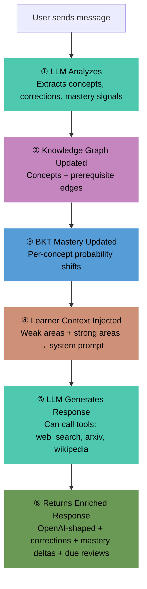
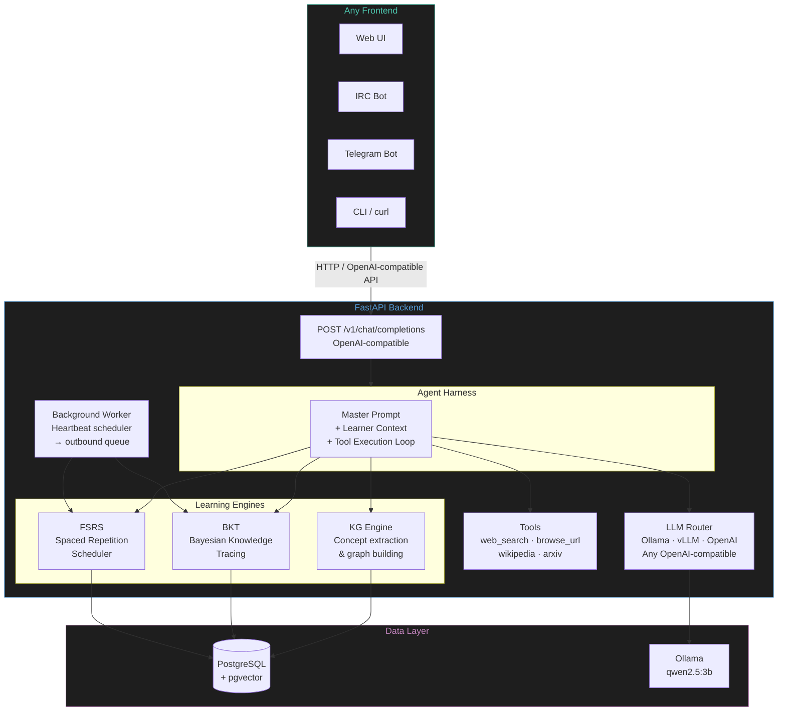
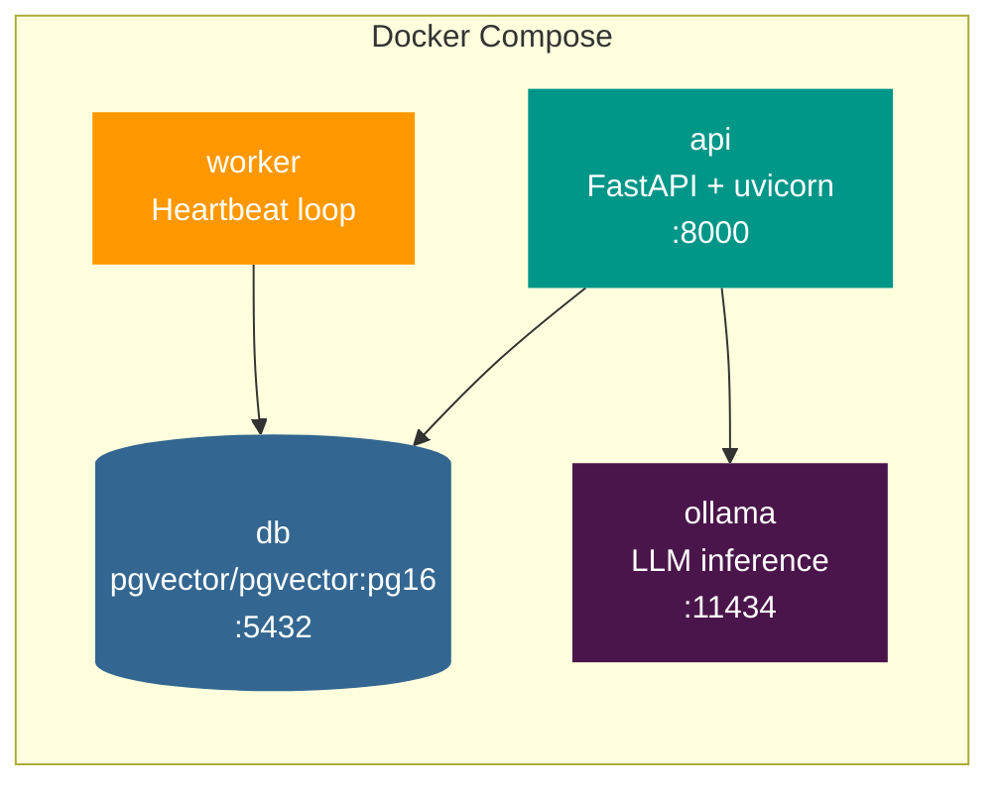

# LearnHarness


**Open-source, self-hosted adaptive learning platform.** Create AI tutor agents with master prompts, tools, and channels. The agent teaches, tracks knowledge, and reviews — for any subject.

## Quick Start

```bash
git clone https://github.com/h4ksclaw/learnharness.git
cd learnharness
docker compose up -d
```

- **API**: `http://localhost:8000` · **Docs**: `http://localhost:8000/docs`
- Includes Postgres+pgvector, API server, background worker, and Ollama.

## Create an Agent

```bash
# Create a German tutor
curl -X POST localhost:8000/v1/agents -H 'Content-Type: application/json' -d '{
  "name": "German Buddy",
  "master_prompt": "You are a friendly German tutor. Only respond in German. Correct mistakes gently.",
  "tools": ["web_search", "wikipedia"],
  "heartbeat_interval": 300
}'
```

Then chat:
```bash
curl -X POST localhost:8000/v1/chat/completions -H 'Content-Type: application/json' -d '{
  "agent_id": "<id from above>",
  "messages": [{"role": "user", "content": "Ich bin müde heute"}]
}'
```

## How It Works



## Architecture



## Container Stack



## Tech Stack

| Layer | Choice |
|-------|--------|
| Backend | FastAPI (Python 3.11+) |
| Database | PostgreSQL + pgvector |
| Spaced Repetition | FSRS (py-fsrs) |
| Knowledge Tracing | BKT (custom) |
| LLM | Any OpenAI-compatible (Ollama default) |
| Tools | web_search, browse_url, wikipedia, arxiv |

## API Endpoints

| Endpoint | Method | Description |
|---|---|---|
| `/v1/chat/completions` | POST | Chat with agent (OpenAI-compatible) |
| `/v1/agents` | GET/POST | List/create agents |
| `/v1/agents/{id}` | GET/PUT/DELETE | Manage agent |
| `/v1/learners` | POST | Create learner |
| `/v1/mastery/{id}` | GET | Knowledge state |
| `/v1/mastery/{id}/categories` | GET | Progress by category |
| `/v1/mastery/{id}/graph` | GET | Knowledge graph |
| `/v1/reviews/{id}` | GET | Due FSRS reviews |
| `/v1/outbound` | GET | Outbound messages (channel adapters poll) |

## Project Status

- [x] FastAPI backend with OpenAI-compatible chat
- [x] FSRS spaced repetition
- [x] BKT knowledge tracing
- [x] LLM knowledge graph engine
- [x] Tools system (web_search, browse_url, wikipedia, arxiv)
- [x] Agent model (master prompt + tools + channels + heartbeat)
- [x] Background worker with proactive scheduling
- [x] Outbound message queue for multi-channel delivery
- [x] 55 unit tests + e2e simulation (all passing)
- [x] Docker Compose (db + api + worker + ollama)
- [x] GitHub Actions CI (Python 3.11 + 3.12)
- [ ] Alembic migrations
- [ ] Web UI
- [ ] Channel adapters (IRC, Telegram)

## License

MIT
