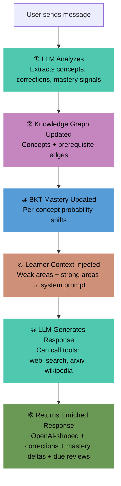
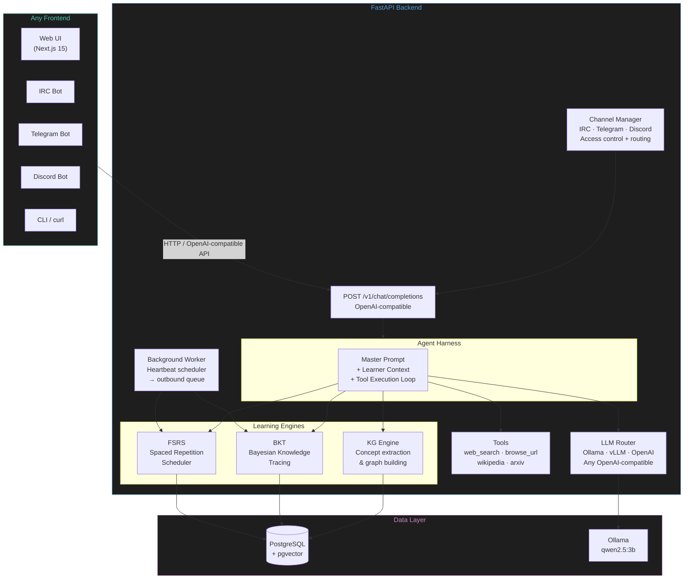
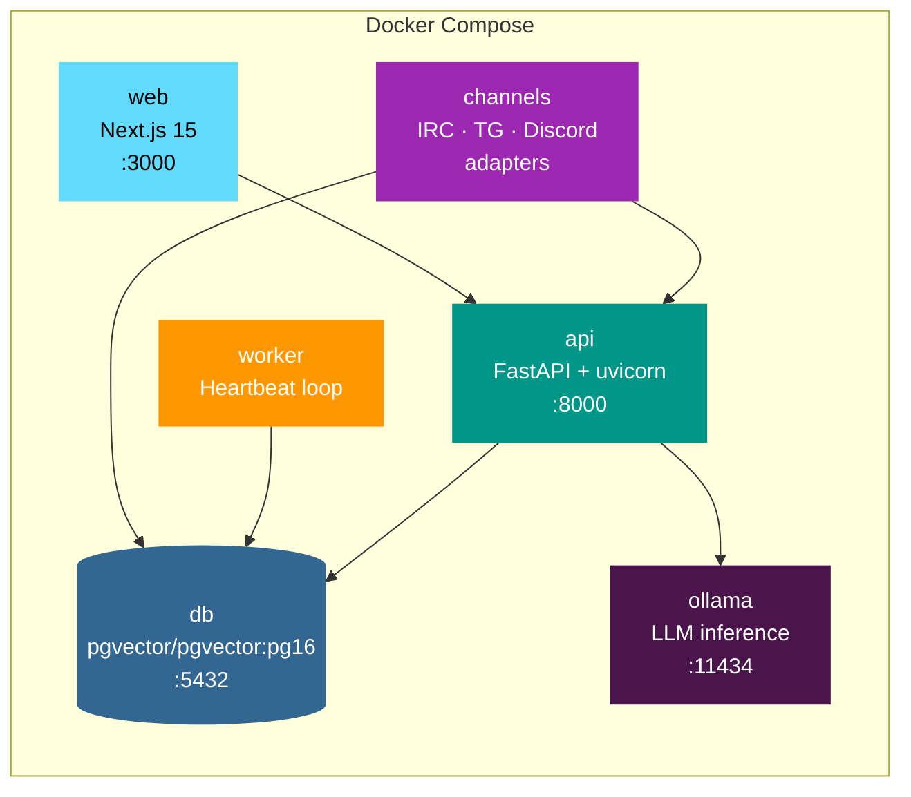
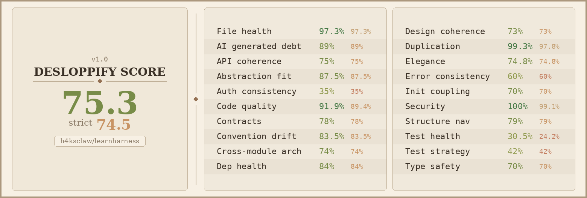

# LearnHarness


**Open-source, self-hosted adaptive learning platform.** Create AI tutor agents with master prompts, tools, and channels. The agent teaches, tracks knowledge, and reviews — for any subject.

**Prebuilt images:**
- `docker pull ghcr.io/h4ksclaw/learnharness/api:latest`
- `docker pull ghcr.io/h4ksclaw/learnharness/worker:latest`
- `docker pull ghcr.io/h4ksclaw/learnharness/channels:latest`

## Quick Start

```bash
git clone https://github.com/h4ksclaw/learnharness.git
cd learnharness
docker compose up -d
```

- **API**: `http://localhost:8000` · **Docs**: `http://localhost:8000/docs`
- **Web UI**: `http://localhost:3000` (agent management, chat, mastery dashboard)
- Includes Postgres+pgvector, API server, background worker, channel adapters, and Ollama.

## Create an Agent

```bash
# Create a German tutor
curl -X POST localhost:8000/v1/agents -H 'Content-Type: application/json' -d '{
  "name": "German Buddy",
  "master_prompt": "You are a friendly German tutor. Only respond in German. Correct mistakes gently.",
  "tools": ["web_search", "wikipedia"],
  "heartbeat_interval": 300
}'
```

Then chat:
```bash
curl -X POST localhost:8000/v1/chat/completions -H 'Content-Type: application/json' -d '{
  "agent_id": "<id from above>",
  "messages": [{"role": "user", "content": "Ich bin müde heute"}]
}'
```

## How It Works



## Architecture



## Container Stack



## Tech Stack

| Layer | Choice |
|-------|--------|
| Backend | FastAPI (Python 3.11+) |
| Frontend | Next.js 15 (React, TypeScript) |
| Database | PostgreSQL + pgvector |
| Spaced Repetition | FSRS (py-fsrs) |
| Knowledge Tracing | BKT (custom) |
| Migrations | Alembic |
| LLM | Any OpenAI-compatible (Ollama default, Groq for demo) |
| Tools | web_search, browse_url, wikipedia, arxiv |
| Channels | IRC, Telegram, Discord adapters with access control |

## API Endpoints

| Endpoint | Method | Description |
|---|---|---|
| `/v1/chat/completions` | POST | Chat with agent (OpenAI-compatible) |
| `/v1/agents` | GET/POST | List/create agents |
| `/v1/agents/{id}` | GET/PUT/DELETE | Manage agent |
| `/v1/learners` | POST | Create learner |
| `/v1/mastery/{id}` | GET | Knowledge state |
| `/v1/mastery/{id}/categories` | GET | Progress by category |
| `/v1/mastery/{id}/graph` | GET | Knowledge graph (nodes + edges) |
| `/v1/mastery/{id}/errors` | GET | Error patterns by concept |
| `/v1/concepts` | POST | Add concept to knowledge graph |
| `/v1/reviews/{id}` | GET | Due FSRS reviews |
| `/v1/reviews/{id}/all` | GET | All review items |
| `/v1/reviews/{id}/answer` | POST | Submit review answer (rating 1-4) |
| `/v1/outbound` | GET | Outbound messages (channel adapters poll) |
| `/v1/outbound/{id}/sent` | POST | Mark outbound message as sent |
| `/` | GET | Health check |
| `/health` | GET | Service health |

## Testing

```bash
# Unit tests (no DB needed)
DATABASE_URL=sqlite+aiosqlite:///test.db pytest tests/ -v \
  --ignore=tests/test_tools.py \
  --ignore=tests/test_tools_system.py \
  --ignore=tests/test_learning_simulation.py

# With coverage
pytest tests/ --cov=app --cov-report=term-missing

# E2E integration test (requires running API + Ollama)
python tests/test_learning_simulation.py
```

### Test Coverage

| Test File | Tests | What It Covers |
|---|---|---|
| `test_fsrs_time.py` | 20 | Time-simulated FSRS: stability growth, lapse recovery, week-of-learning, rating effects |
| `test_bkt_comprehensive.py` | 19 | BKT convergence, dynamics, soft inference, recovery, boundary conditions |
| `test_schemas.py` | 19 | Pydantic validation: agent, chat, corrections, mastery, reviews |
| `test_channels.py` | 20 | Channel access control, allowlist/blocklist, DM permissions, require_mention |
| `test_models.py` | 16 | ORM models: creation, relationships, constraints |
| `test_schemas_extended.py` | 7 | ConceptCreate, OutboundMessageOut extra field, AgentOut token masking |
| `test_config.py` | 6 | Settings, defaults, DB engine |
| `test_knowledge_tracing.py` | 5 | BKT correctness: update, ceiling, floor, inference |
| `test_bkt.py` | 9 | KnowledgeTracer: mastery updates, convergence, custom parameters |
| `test_tools_registry.py` | 4 | Tool definitions, OpenAI schema generation, execution |
| `test_fsrs.py` | 4 | Basic FSRS mechanics |
| `test_tools_system.py` | 11 | Tool registry, OpenAI schemas, execution (network required) |
| `test_tools.py` | 3 | Live tool tests (network required) |
| `test_learning_simulation.py` | 6 | **E2E**: 8-turn conversation with live LLM |

## Development

```bash
# Install with dev dependencies
pip install -e ".[dev]"

# Lint and format
ruff check app/ tests/
ruff format app/ tests/

# Type check
mypy app/ --ignore-missing-imports

# Pre-commit hooks
pre-commit install
pre-commit run --all-files

# Generate a new migration after model changes
alembic revision --autogenerate -m "description of change"
```

### Code Quality Tools

| Tool | Purpose |
|------|---------|
| **ruff** | Linting (E, F, I, N, W, UP, B, SIM, C4) + formatting. One import per line. |
| **mypy** | Type checking with `warn_return_any` |
| **pre-commit** | Auto-runs ruff, ruff-format, mypy, whitespace checks on commit |
| **pytest** | 139 unit tests + e2e simulation (all passing) |
| **GitHub Actions** | CI: lint, test (Python 3.11+3.12), mypy, docker, GHCR publish |

## Project Status

- [x] FastAPI backend with OpenAI-compatible chat
- [x] FSRS spaced repetition
- [x] BKT knowledge tracing
- [x] LLM knowledge graph engine
- [x] Tools system (web_search, browse_url, wikipedia, arxiv)
- [x] Agent model (master prompt + tools + channels + heartbeat)
- [x] Background worker with proactive scheduling
- [x] Outbound message queue for multi-channel delivery
- [x] Alembic migrations
- [x] 139 unit tests + e2e simulation (all passing)
- [x] Docker Compose (db + api + worker + channels + ollama)
- [x] GitHub Actions CI (lint + test + mypy + docker + GHCR)
- [x] ruff + mypy + pre-commit
- [x] Web UI (Next.js 15 — agent management, chat, mastery dashboard, settings)
- [x] Channel adapters (IRC, Telegram, Discord) with access control
- [x] One-command demo deployment (Groq + Docker, no GPU needed)

## Code Quality



## License

MIT
