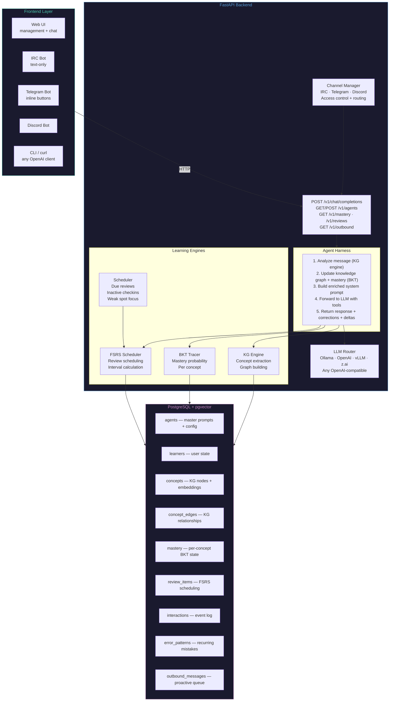
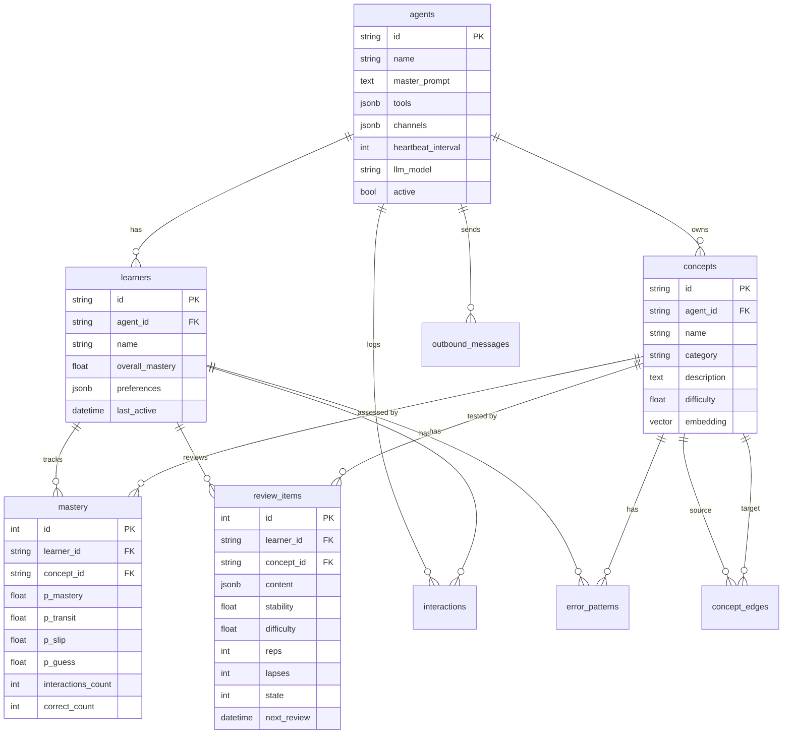
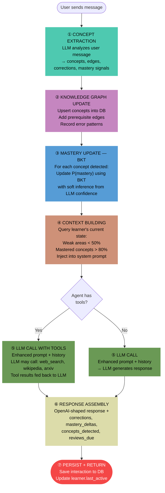
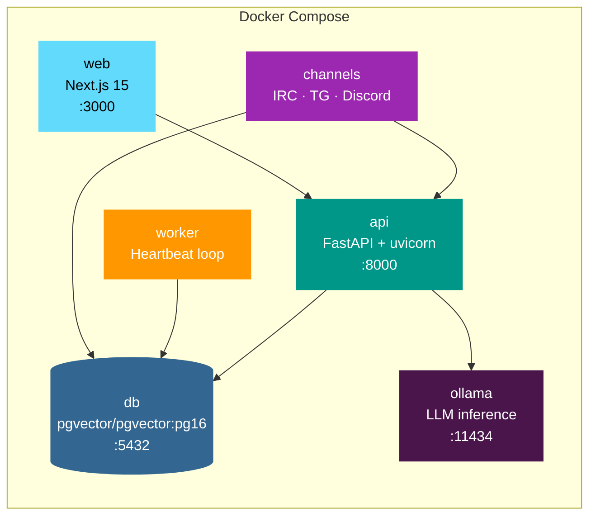

# LearnHarness — Architecture

## System Overview



## Data Model



## Chat Pipeline

Every message goes through this pipeline:



## Frontend Protocol

The API returns a standard OpenAI response with optional extension fields:

```json
{
  "id": "chatcmpl-...",
  "object": "chat.completion",
  "model": "qwen2.5:3b",
  "choices": [{
    "message": {"role": "assistant", "content": "Das ist richtig! ..."},
    "finish_reason": "stop"
  }],

  "corrections": [{
    "original": "ich bin müde",
    "corrected": "ich habe mühe",
    "rule": "Use 'haben' with 'Mühe'",
    "concept_id": "haben_vs_sein",
    "severity": "warning"
  }],
  "mastery_deltas": [{
    "concept": "haben_vs_sein",
    "before": 0.52,
    "after": 0.43,
    "direction": "down"
  }],
  "concepts_detected": ["haben_vs_sein", "adjective_endings"],
  "reviews_due": [{"id": 42, "concept_id": "...", "next_review": "..."}]
}
```

| Frontend | How It Renders |
|----------|---------------|
| **Web UI** | Corrections as inline expandable overlays, mastery deltas as badges, reviews as toasts |
| **IRC bot** | Flatten to text: `"⚠️ Correction: use 'haben' with 'Mühe'"` |
| **Telegram** | Inline keyboard buttons: `[Expand correction]` `[Show progress]` |
| **Discord** | Threaded replies with embed cards |
| **Standard OpenAI client** | Just sees the text response — learning logic runs silently |

## Proactive Scheduler (Heartbeat)

```mermaid
flowchart LR
    TICK[Heartbeat tick<br/>every 60s] --> LOOP

    subgraph LOOP["For each active agent"]
        CHECK{"Time since<br/>last heartbeat<br/>≥ interval?"}
        CHECK -- No --> SKIP[Skip]
        CHECK -- Yes --> L1

        subgraph L1["For each learner"]
            R{"FSRS reviews<br/>due?"}
            R -- Yes --> MSG1["📝 Review reminder<br/>'You have N reviews due'"]

            I{"Inactive<br/>> 24h?"}
            I -- Yes --> MSG2["👋 Inactivity checkin<br/>'Want to practice?'"}

            W{"Weakest concept<br/>< 30%?"}
            W -- Yes --> MSG3["🎯 Weak spot focus<br/>'Let's work on X'"]
        end

        MSG1 --> Q[Outbound message queue]
        MSG2 --> Q
        MSG3 --> Q
    end

    Q --> ADAPTER["Channel Adapters<br/>poll /v1/outbound"]
    ADAPTER --> DELIVER["Deliver via IRC<br/>Telegram · Discord · Web push"]

    style TICK fill:#FF9800,stroke:none,color:#000
    style Q fill:#569CD6,stroke:none,color:#000
    style DELIVER fill:#4EC9B0,stroke:none,color:#000
```

## Container Stack



## File Structure

```
learnharness/
├── app/
│   ├── main.py                  # FastAPI app, lifespan, router registration
│   ├── config.py                # Environment-driven settings
│   ├── db.py                    # Async SQLAlchemy session
│   ├── models.py                # All ORM models (9 tables)
│   ├── schemas.py               # Pydantic request/response models
│   ├── harness.py               # Main agent chat processing pipeline
│   ├── tools.py                 # Agent tools (web_search, wikipedia, arxiv)
│   ├── worker.py                # Background heartbeat worker
│   ├── routers/
│   │   ├── chat.py              # POST /v1/chat/completions
│   │   ├── agents.py            # Agent + Learner CRUD
│   │   ├── mastery.py           # Knowledge state + graph queries
│   │   ├── reviews.py           # FSRS review management
│   │   └── heartbeat.py         # Outbound message queue
│   ├── channels/
│   │   ├── base.py              # BaseChannelAdapter + AccessControl
│   │   ├── irc.py               # IRC adapter (asyncio sockets)
│   │   ├── telegram.py          # Telegram adapter (httpx long-poll)
│   │   ├── discord.py           # Discord adapter (websockets + REST)
│   │   └── manager.py           # Channel lifecycle manager
│   └── engine/
│       ├── llm.py               # OpenAI-compatible LLM router + instructor
│       ├── fsrs_sched.py        # FSRS spaced repetition
│       ├── knowledge_tracing.py # BKT mastery estimation
│       └── knowledge_graph.py   # LLM concept extraction + graph mgmt
├── web/                         # Next.js 15 frontend
│   └── src/app/
│       ├── page.tsx             # Agent management (home)
│       ├── chat/page.tsx        # Chat interface
│       ├── mastery/page.tsx     # FSRS + BKT dashboard
│       └── settings/page.tsx    # Settings
├── tests/
│   ├── test_fsrs_time.py        # Time-simulated FSRS tests (20)
│   ├── test_bkt_comprehensive.py # BKT convergence/dynamics (19)
│   ├── test_channels.py         # Channel access control (20)
│   ├── test_schemas.py          # Pydantic validation (19)
│   ├── test_models.py           # Model validation (16)
│   ├── test_bkt.py              # KnowledgeTracer (9)
│   ├── test_schemas_extended.py # Extended schemas (7)
│   ├── test_config.py           # Settings (6)
│   ├── test_knowledge_tracing.py # Basic BKT (5)
│   ├── test_tools_registry.py   # Tool registry (4)
│   ├── test_fsrs.py             # Basic FSRS (4)
│   └── test_learning_simulation.py # E2E conversation
├── .github/workflows/
│   ├── tests.yml                # Lint + test (Python 3.11+3.12) + web build
│   ├── docker.yml               # Docker compose verification
│   └── docker-publish.yml       # Build & publish to GHCR
├── docs/
│   ├── ARCHITECTURE.md          # This file
│   └── VISION.md                # Vision + design decisions
├── deploy/                      # Demo deployment configs
├── compose.yaml                 # Full stack: db + api + worker + channels + web + ollama
├── Dockerfile                   # Multi-stage: api, worker, channels targets
├── pyproject.toml
└── README.md
```
